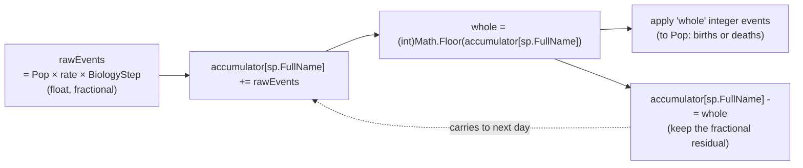

# Accumulator pattern

Source: `_birthAccumulators`, `_predationAccumulators`, `_naturalDeathAccumulators`, `_conditionDeathAccumulators`, `_thermalDeathAccumulators` (declared in `EcosystemSimulator.cs`).



## Why

The simulator operates on daily timesteps, but biological events are rarely integer-sized. A species with 100 individuals and a 0.003/day natural death rate expects 0.3 deaths per day — rounding each day to 0 would lose all mortality; rounding to 1 would overcount 3×.

Accumulators let fractional events build up across days. Death or birth only manifests as an integer delta to `Population` once enough fractional events have accumulated.

## Users of this pattern

| Accumulator | Step | Event type | Key |
|-------------|------|-----------|-----|
| `_birthAccumulators` | 8 | Births (adds to `Population`) | `sp.FullName` |
| `_predationAccumulators` | 2 | Prey removals (distributed across prey variants) | `sp.FullName` |
| `_naturalDeathAccumulators` | 9 | Natural deaths | `sp.FullName` |
| `_conditionDeathAccumulators` | 7 | Condition-driven deaths | `sp.FullName` |
| `_thermalDeathAccumulators` | declared, unused | — | thermal death is binary/instant (Step 6), so fractional accumulation is unnecessary |

## Accumulator lifecycle

- **Initialization**: `InitializeAccumulators(fullName)` is called per species in `InitializeFromRunSpeciesList`, zeroing the entry in each dictionary.
- **Reset**: `ClearAccumulators()` zeroes all five dictionaries. Invoked at scenario start and whenever species are re-seeded.
- **Snapshot**: `UpdateAccumulatorTotals()` copies current accumulator values to public properties (`BirthAccumT1`, `NaturalDeathAccumT1`, etc.) so each day's `StepRecord` can capture them.

## CSV visibility

Accumulator values are written to every daily row in the scenario CSV:

**Tier-level (legacy, sums across the tier):**

```
BirthAccumT1, BirthAccumT2,
NaturalDeathAccumT1, NaturalDeathAccumT2,
ConditionDeathAccumT1, ConditionDeathAccumT2,
PredationAccumT1
```

**Per-species (v12, residuals exposed via accessors):**

```
{S}_BirthAccum, {S}_NatDeathAccum, {S}_CondDeathAccum, {S}_PredAccum
```

The per-species accumulator residuals are read at CSV-write time via the public accessors `EcosystemSimulator.GetBirthAccum(fullName)`, `GetNaturalDeathAccum(fullName)`, `GetConditionDeathAccum(fullName)`, `GetPredationAccum(fullName)` (added in v12). For Tier 2 species, `{S}_PredAccum` is always 0 (predation accumulator is Tier 1 only).

They can be non-zero even on days where `LastBirthsT1 == 0` — meaning the simulator has accumulated partial births but hasn't crossed the whole-integer threshold yet.

## Per-variant predation note

`_predationAccumulators` is special: prey deaths are computed at the tier level (how many prey were eaten total) and then distributed across prey variants proportional to their populations. Each variant's key in the dictionary is that variant's `FullName` (e.g. `"Hexapod_Arctic"`).
