# Diagram: Per-Day Biology Step Sequence

This flowchart shows the ten ordered steps that `EcosystemSimulator.ProcessBiologyStep(float temperature)` runs once per biology day (`EcosystemSimulator.cs:543-700`). Each step runs its own `foreach (var sp in Species)` loop to completion before the next step starts (step-major execution), so a step that reads a whole-tier total sees one consistent snapshot. The sequence is preceded by a snapshot-and-reset block (`EcosystemSimulator.cs:545-584`) that captures start populations, zeroes the tier `Last*` counters, and clears and re-seeds the per-species dictionaries; it is followed by an end-of-day rollup (`EcosystemSimulator.cs:688-699`) that computes average condition, records end populations, and sums accumulator residuals. The current shipping configuration is Tier 1 (prey) only: `Tier2Enabled` defaults to `false` (`EcosystemSimulator.cs:245`), so the Holling Type II predator path inside Step 2 is dormant legacy. Populations are stored as `float` through the whole day and are rounded to integers only at Step 10. The labels below name the formulas; for each variable, its units, and its defaults see `biology-and-formulas.md`.

```mermaid
flowchart TD
    A["ProcessBiologyStep(temperature °C)"] --> RESET["Snapshot and reset (EcosystemSimulator.cs:545-584)<br/>StartPopT1/T2 = GetTier1/2Population()<br/>zero tier Last* counters; LastFedRateT2=1, LastAvgHuntingEfficiency=1<br/>clear + re-seed per-species dicts<br/>StartPopBySpecies[FullName] = SafePopToLong(Population)<br/>(accumulator residual dicts NOT cleared; they persist across days)"]

    RESET --> S1["STEP 1 Thermal performance (cs:589-598)<br/>RawThermalPerformance = CalculatePerformance(temp)  [0,1], no Pmax<br/>ThermalPerformance = RawThermalPerformance * Pmax<br/>FedRate = 1; CurrentHuntingSuccess = 1"]

    S1 --> S2["STEP 2 Feeding / predation (cs:600-602, body 728)<br/>Tier 1: foodDensity = max(0, 1 - sum(pop*max(1,eatingAmount))/capSafe)<br/>resourceRatio = capSafe / max(tier1Pop, 1)<br/>gatherSuccess_i = Holling(HuntingEfficiency_i, resourceRatio) + variance<br/>FedRate_i = min(1, gatherSuccess_i * foodDensity)<br/>LastFedRateT1 = pop-weighted mean (1 if none alive)<br/>Tier 2 (legacy, dormant): Holling II, prey removed via accumulator"]

    S2 --> S3["STEP 3 Raw final performance (cs:604-610)<br/>RawFinalPerformance = RawThermalPerformance * FedRate<br/>(this is the Condition drain target)"]

    S3 --> S4["STEP 4 Update Condition (cs:612-617, body 952)<br/>target = RawFinalPerformance; pmaxSafe = max(Pmax, 1e-4)<br/>drain:  Condition -= (Condition-target) * drainRate*(1+(1-target)^2)/pmaxSafe<br/>recover: Condition += (target-Condition) * recoveryRate*(1+target^2)*pmaxSafe<br/>Condition = clamp(Condition, 0, 1); persists across days<br/>(no BiologyStep multiplier here)"]

    S4 --> S5["STEP 5 Final performance (cs:619-630)<br/>FinalPerformance = ThermalPerformance * FedRate<br/>CSV / log only; no later step reads it"]

    S5 --> S6["STEP 6 Thermal death (cs:632-637, body 1000)<br/>if RawThermalPerformance == 0 (at/beyond CTmin/CTmax):<br/>Population = 0; Condition = 0  (instant total kill)<br/>else survive the step"]

    S6 --> S7["STEP 7 Condition death (cs:639-644, body 1056)<br/>fires only when Condition < DeathThreshold<br/>severity = (DeathThreshold - Condition)/DeathThreshold<br/>rawDeaths = Population * severity * DeathRate * BiologyStep<br/>accumulator -> whole deaths capped at Population<br/>survivor boost: Condition = min(1, oldCond*oldPop/newPop)"]

    S7 --> S8["STEP 8 Reproduction (cs:646-651, body 1150)<br/>require Population >= 2 (MIN_POPULATION_FOR_REPRODUCTION)<br/>reproScale from Condition vs ReproThreshold (piecewise, joins at 0.10)<br/>births = Population * reproScale * ReproductionMultiplier * Pmax * BiologyStep<br/>accumulator -> whole births ADDED, no cap; newborns inherit Condition"]

    S8 --> S9["STEP 9 Natural death (cs:653-658, body 1270)<br/>variance = (rng.NextDouble()*2-1) * NaturalDeathVariance<br/>baseRate = max(0, NaturalDeathRate + variance)<br/>deaths = Population * baseRate * BiologyStep<br/>accumulator -> whole deaths capped at Population"]

    S9 --> S10["STEP 10 Rounding + overflow guard (cs:660-686)<br/>popCap = 100 * CarryingCapacityPerTier; if Population > popCap clamp<br/>Population = Math.Round(Population, AwayFromZero)<br/>(integer-valued float after this step)"]

    S10 --> ROLL["End-of-day rollup (cs:688-699)<br/>ComputeAverageCondition -> AvgConditionT1/T2<br/>EndPopT1/T2 = GetTier1/2Population()<br/>UpdateAccumulatorTotals -> tier accumulator totals for CSV"]

    S6 -. "Population may reach 0" .-> CRASH{{"After the step, SimulationRunner checks<br/>Ecosystem.HasCrashed() (total pop == 0)<br/>and breaks the day loop (SimulationRunner.cs:440-447)"}}
    ROLL --> CRASH
```

