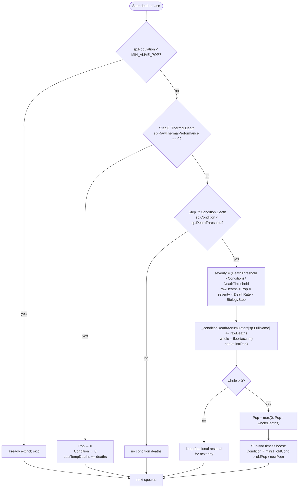

# Biology death phase (Steps 6–7)

Source: `EcosystemSimulator.ApplyThermalDeath`, `EcosystemSimulator.ApplyConditionDeath`.

## Design rationale (from source comments)

- **Thermal death is terminal**. Performance reaching zero means the organism is past its lethal limit (`CTmin` or `CTmax` after the 2°C cosine fade). No Condition buffer can save it; population and condition both go to zero.
- **Suboptimal-but-survivable** temperatures do **not** trigger Step 6 — they drive Condition down in Step 4, and Step 7 converts chronic low Condition into graduated mortality.
- **Condition death is graduated** (not a cliff). Severity ranges from `0` at `Condition = DeathThreshold` to `1` at `Condition = 0`. Source citations: Casini et al. (2016), Dutil & Lambert (2000), Booth & Hixon (1999) — mortality proportional to condition severity, not binary.
- **Survivor fitness boost** prevents death spirals. After deaths, `Condition = oldCond × oldPop / newPop` (capped at 1.0). This assumes the dead were the weakest (condition ≈ 0) and redistributes the survivor pool's health. Without this, a hit below `DeathThreshold` would compound as the group's average Condition stays low and more deaths keep firing.

## Accumulator detail

`_conditionDeathAccumulators[sp.FullName]` is a float that carries fractional deaths across days. If `rawDeaths = 0.3/day`, after four days the accumulator has 1.2 → one whole death fires, 0.2 residual carries forward. Scaling by `BiologyStep` means multi-day biology cycles multiply `rawDeaths` accordingly.

## Pmax does NOT appear here

Both Step 6 and Step 7 are Pmax-blind. Specialist resilience comes indirectly — in Step 4 their Condition drains slower (v9 Pmax rate scaling), so they cross `DeathThreshold` less often.
