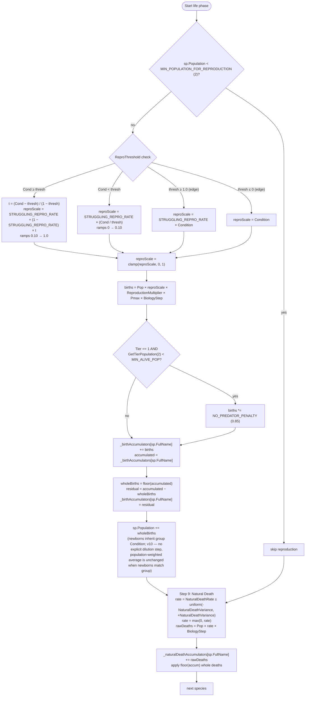

# Biology life phase (Steps 8–9)

Source: `EcosystemSimulator.ApplyReproduction` (v9: Pmax multiplier; v10: soft-cap-on-births deleted, newborns inherit parent Condition), `EcosystemSimulator.ApplyNaturalDeathWithAccumulator`.

## Reproduction key invariants

- **Two-region piecewise formula** for `reproScale`, continuous at `ReproThreshold` (both halves meet at `STRUGGLING_REPRO_RATE = 0.10`).
- **Pmax multiplier (v9)**: `births *= sp.Pmax`. A specialist (Pmax = 0.9) produces 25% more births at the same Condition as a generalist (Pmax = 0.72).
- **No-predator penalty** is 0.85 — Tier 1 gets 15% fewer births when no predators exist, modelling ecosystem imbalance.
- **(v10) Soft cap on births DELETED.** Tier 1 is now throttled indirectly via the Condition pathway: high pop → low food density (Step 2a) → low FedRate → low RawFinalPerformance target → Condition drains → reproScale shrinks AND condition deaths fire. The processing-order bug from the live `tierPop` read is gone with this code path.
- **Birth accumulator** carries fractional births. Matters at low `reproScale` or low population, where daily births < 1.
- **(v10) Newborn Condition = parent group Condition.** No fixed `NEWBORN_CONDITION = 0.5` constant. Parent's Condition already encodes recent food / hunting history via lagged drain dynamics, so multiplying again by today's FedRate would double-count. Mathematically: the population-weighted average is unchanged when newborns match the group, so no explicit Condition update step is needed. Newborn vulnerability emerges from same-drain-no-head-start dynamics in subsequent days.

## Natural death key invariants

- Independent of temperature, Condition, feeding, and predation.
- Rate is re-rolled per species per step from `[NaturalDeathRate − NaturalDeathVariance, NaturalDeathRate + NaturalDeathVariance]`.
- Uses its own accumulator; fractional deaths carry to the next day.
- Natural death does **not** give a survivor fitness boost (unlike condition death). It models stochastic mortality rather than health-driven.

## Step order within a single species

Species loops are nested: each step iterates all species before moving on. So reproduction (8) and natural death (9) for a given species are not adjacent in wall time — Step 8 completes for **every** species before Step 9 begins.
