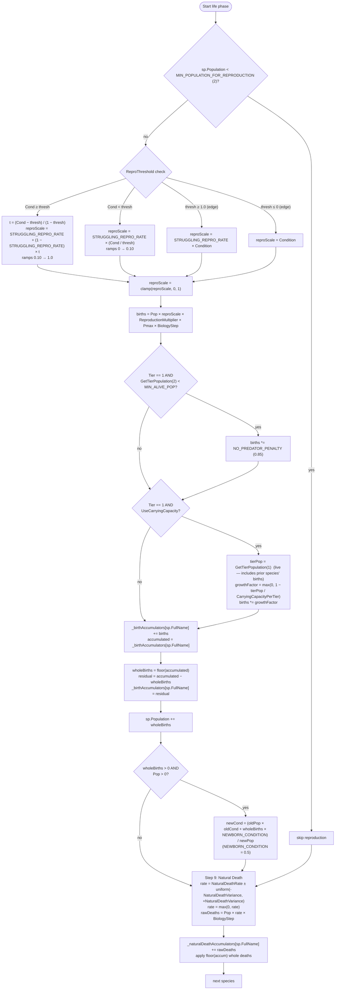

# Biology life phase (Steps 8–9)

Source: `EcosystemSimulator.ApplyReproduction` (v9: Pmax multiplier), `EcosystemSimulator.ApplyNaturalDeathWithAccumulator`.

## Reproduction key invariants

- **Two-region piecewise formula** for `reproScale`, continuous at `ReproThreshold` (both halves meet at `STRUGGLING_REPRO_RATE = 0.10`).
- **Pmax multiplier (v9)**: `births *= sp.Pmax`. A specialist (Pmax = 0.9) produces 25% more births at the same Condition as a generalist (Pmax = 0.72).
- **No predator penalty** is 0.85 — Tier 1 gets 15% fewer births when no predators exist, modelling ecosystem imbalance.
- **Soft carrying cap**: `growthFactor = max(0, 1 − tierPop / CarryingCapacityPerTier)`. Tier 1 only. `tierPop` is evaluated live, so the first species processed sees a slightly lower `tierPop` than the last — a known first-mover artefact.
- **Birth accumulator** carries fractional births. Matters at low `reproScale` or low population, where daily births < 1.
- **Newborn dilution**: adding offspring at `NEWBORN_CONDITION = 0.5` pulls the group's average Condition down toward 0.5 if many newborns enter at once.

## Natural death key invariants

- Independent of temperature, Condition, feeding, and predation.
- Rate is re-rolled per species per step from `[NaturalDeathRate − NaturalDeathVariance, NaturalDeathRate + NaturalDeathVariance]`.
- Uses its own accumulator; fractional deaths carry to the next day.
- Natural death does **not** give a survivor fitness boost (unlike condition death). It models stochastic mortality rather than health-driven.

## Step order within a single species

Species loops are nested: each step iterates all species before moving on. So reproduction (8) and natural death (9) for a given species are not adjacent in wall time — Step 8 completes for **every** species before Step 9 begins.
