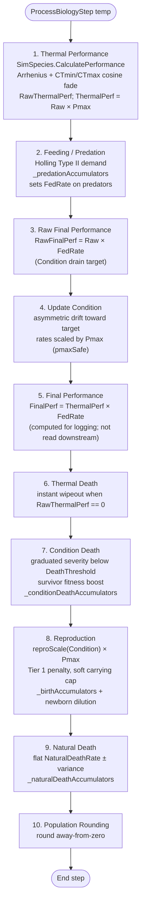

# Biology step — 10-step overview

Source: `EcosystemSimulator.ProcessBiologyStep(float temperature)`.

## Ordering and iteration

Every step iterates `Species` in the order they were added to `RunSpeciesList`. A species processed earlier in a step may influence the denominator for a species processed later (notably the soft carrying cap in Step 8, which reads `GetTierPopulation(1)` live after previous species' births have been added).

## What each step writes back

| Step | Writes | Notes |
|------|--------|-------|
| 1 | `RawThermalPerformance`, `ThermalPerformance` | Per species. |
| 2 | `FedRate` (predators), `CurrentHuntingSuccess`, `LastFedRateT2`, `LastAvgHuntingEfficiency`, `LastEatenT1`, accumulator updates on prey | Prey `FedRate` stays 1.0. |
| 3 | `RawFinalPerformance` | Per species. |
| 4 | `Condition` (clamped 0–1), `AvgConditionT1`/`AvgConditionT2` later | `oldCondition` logged. |
| 5 | `FinalPerformance` | Never read again in this pipeline. |
| 6 | `Population → 0`, `Condition → 0` when lethal | Also increments `LastTempDeathsT1`/`T2`. |
| 7 | `Population -= wholeDeaths`, `Condition` boosted, `LastConditionDeathsT1`/`T2`, `_conditionDeathAccumulators` | Survivor boost caps Condition at 1.0. |
| 8 | `Population += wholeBirths`, `Condition` diluted by newborns at 0.5, `LastBirthsT1`/`T2`, `_birthAccumulators`, `LastReproScaleT1`/`T2` | Tier 1 gets `NO_PREDATOR_PENALTY` and carrying-capacity multiplier. |
| 9 | `Population -= wholeNaturalDeaths`, `LastNaturalDeathsT1`/`T2`, `_naturalDeathAccumulators` | No Condition effect. |
| 10 | `Population = Math.Round(Population, AwayFromZero)` | All populations integer-valued between days. |

After Step 10, `ComputeAverageCondition()` + `UpdateAccumulatorTotals()` + `EndPopT1/T2` are updated for the CSV record.
