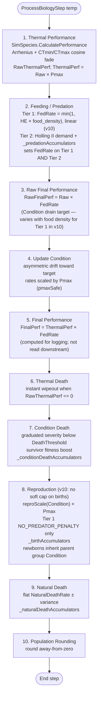

# Biology step — 10-step overview

Source: `EcosystemSimulator.ProcessBiologyStep(float temperature)`.

## Ordering and iteration

Every step iterates `Species` in the order they were added to `RunSpeciesList`. In v10, the only previously order-dependent step (Step 8 carrying-cap-on-births) was deleted, so Step 8 is now order-independent. The remaining steps were always order-independent — they don't read state that previous species in the same step have written.

## What each step writes back

| Step | Writes | Notes |
|------|--------|-------|
| 1 | `RawThermalPerformance`, `ThermalPerformance` | Per species. |
| 2 | `FedRate` (Tier 1 AND Tier 2), `CurrentHuntingSuccess`, `LastFedRateT1`, `LastFedRateT2`, `LastFoodDensityT1`, `LastAvgHuntingEfficiency`, `LastEatenT1`, accumulator updates on prey | v10: Tier 1 FedRate = min(1, HE × food_density), no longer hardcoded to 1.0. |
| 3 | `RawFinalPerformance` | Per species. |
| 4 | `Condition` (clamped 0–1), `AvgConditionT1`/`AvgConditionT2` later | `oldCondition` logged. |
| 5 | `FinalPerformance` | Never read again in this pipeline. |
| 6 | `Population → 0`, `Condition → 0` when lethal | Also increments `LastTempDeathsT1`/`T2`. |
| 7 | `Population -= wholeDeaths`, `Condition` boosted, `LastConditionDeathsT1`/`T2`, `_conditionDeathAccumulators` | Survivor boost caps Condition at 1.0. |
| 8 | `Population += wholeBirths`, `LastBirthsT1`/`T2`, `_birthAccumulators`, `LastReproScaleT1`/`T2` | v10: only Tier 1 modifier left is `NO_PREDATOR_PENALTY` (carrying-cap-on-births deleted). Newborns inherit group Condition (no explicit dilution step). |
| 9 | `Population -= wholeNaturalDeaths`, `LastNaturalDeathsT1`/`T2`, `_naturalDeathAccumulators` | No Condition effect. |
| 10 | `Population = Math.Round(Population, AwayFromZero)` | All populations integer-valued between days. |

After Step 10, `ComputeAverageCondition()` + `UpdateAccumulatorTotals()` + `EndPopT1/T2` are updated for the CSV record.
