# Biology performance phase (Steps 1–5)

Source: `SimSpecies.CalculatePerformance`, `EcosystemSimulator.ProcessFeedingWithAccumulator`, `EcosystemSimulator.UpdateCondition` (v9 Pmax rate scaling, v10 Tier 1 food-pool FedRate).

```mermaid
flowchart TD
    Temp["Temperature °C"] --> Offset["T_eff = T + sp.TemperatureDebuff"]
    Offset --> Fade["Cosine fade over<br/>LETHAL_TRANSITION_WIDTH = 2°C<br/>near CTminC / CTmaxC"]
    Fade --> Arr["Arrhenius in Kelvin:<br/>numerator = exp(B/OT − B/T) · (1 + exp(L/OT − L/LB) + exp(U/UB − U/OT))<br/>denominator = 1 + exp(L/T − L/LB) + exp(U/UB − U/T)<br/>perf = clamp(num/den, 0, 1)"]
    Arr --> Raw["RawThermalPerformance<br/>= perf × fade"]
    Raw --> TP["ThermalPerformance<br/>= Raw × Pmax"]

    Pop1["tier1Pop = sum of Tier 1 populations"] --> FoodDensity["food_density = max(0, 1 − tier1Pop / cap)<br/>cap always on (v11.1); cap floored at 1"]
    FoodDensity --> FedRateT1["FedRate (Tier 1, v10) = min(1, HE × food_density)<br/>linear extraction (NOT Holling II)"]

    TP --> PredDemand["Predator rawDemand<br/>= Pop × EatingAmount × ThermalPerf × BiologyStep"]
    PredDemand --> Holling["Holling II success<br/>holling = ratio / (ratio + halfSat)<br/>halfSat = NORMAL_PREY_RATIO · (1 − base) / base<br/>+ variance in [-HuntingVariance, +HuntingVariance]<br/>clamp to [0, 1]"]
    Holling --> Actual["actualDemand = rawDemand × huntingSuccess"]
    Actual --> Eaten["totalEaten = min(availablePrey, Σ actualDemand)"]
    Eaten --> ScarcityT2["scarcityFactor (v11)<br/>= totalEaten / totalActualDemand<br/>(1.0 when prey abundant)"]
    ScarcityT2 --> FedRateT2["FedRate_i (Tier 2, v11)<br/>= min(1, huntingSuccess_i × scarcityFactor)<br/>(per-predator; LastFedRateT2 = pop-weighted avg)"]

    Raw --> RFP["RawFinalPerformance<br/>= Raw × FedRate<br/>(Condition drain target)"]
    FedRateT1 --> RFP
    FedRateT2 --> RFP

    RFP --> CondStep{"Condition vs target<br/>(pmaxSafe = max(Pmax, 1e-4))"}
    CondStep -- "Cond > target" --> Drain["severity = (1 - target)²<br/>effectiveDrain = ConditionDrainRate · (1 + severity) / pmaxSafe<br/>Condition -= (Condition - target) × effectiveDrain"]
    CondStep -- "Cond < target" --> Recov["boost = target²<br/>effectiveRecovery = ConditionRecoveryRate · (1 + boost) × pmaxSafe<br/>Condition += (target - Condition) × effectiveRecovery"]
    Drain --> Clamp["Condition = clamp(Condition, 0, 1)"]
    Recov --> Clamp
    Clamp --> FP["FinalPerformance<br/>= ThermalPerf × FedRate<br/>(logging only)"]
```

## Key invariants

- `Pmax` does **not** enter `target`. Target stays at `Raw × FedRate`, so Condition ceiling is 1.0 for every species regardless of Pmax.
- Drain is **asymmetric**: base drain `0.15` > base recovery `0.10` (per-day rates from `SimulationConfig`).
- Quadratic acceleration:
  - Drain multiplier = `1 + (1 − target)²` → reaches 2× at `target = 0`.
  - Recovery multiplier = `1 + target²` → reaches 2× at `target = 1`.
- Pmax rate scaling (v9):
  - Specialists (high Pmax, e.g. 0.9) drain `1 / 0.9 ≈ 1.11×` the base rate (slower relative reduction because denominator is closer to 1).
  - Generalists (low Pmax, e.g. 0.72) drain `1 / 0.72 ≈ 1.39×` the base rate (faster decline under stress).
  - Recovery inverts: specialists recover `× 0.9` ≈ 10% slower; generalists `× 0.72` ≈ 28% slower. (Multiplier ≤ 1 means the recovery term is damped when Pmax < 1.)

## Step 2 — feeding details

### 2a. Tier 1 (food-pool, linear, v10)

- Runs unconditionally — does not require predators to be present.
- `food_density = max(0, 1 − tier1Pop / max(CarryingCapacityPerTier, 1))`. Carrying capacity is always on (v11.1); the previous toggle was removed because Tier 1 species without a resource ceiling grow without bound.
- `FedRate = min(1, HuntingEfficiency × food_density)`. Default HE=1 gives `FedRate = food_density`.
- **Linear, not Holling II.** Tier 1 represents passive extractors (plankton, filter feeders). No search/handling phases. Holling II would also collapse to 1 at HE=1, defeating the food-pool effect.
- For Tier 1, `HuntingEfficiency` is semantically "resource extraction efficiency" — same field, dual meaning by tier.

### 2b. Tier 2 (Holling II + per-predator FedRate, v11)

- Runs only if `Species.Any(Tier == 1)` and `Species.Any(Tier == 2)` with non-zero populations.
- `NORMAL_PREY_RATIO = 20` is the prey:predator ratio where Holling success equals the species' `HuntingEfficiency`.
- **Per-predator FedRate (v11)**: `scarcityFactor = totalEaten / totalActualDemand` (1.0 when prey abundant); `fedRate_i = min(1, huntingSuccess_i × scarcityFactor)`. Each predator's feeding satisfaction reflects its own hunting effort. `LastFedRateT2` (CSV column) is now a population-weighted average across predator species. Reduces to v10 pooled formula in single-predator-species runs.
- Prey removals are distributed proportionally across prey variants via `_predationAccumulators[preyVariant.FullName]`. (No predator-side preference for prey variants — separate concern, B7 in pending list.)
