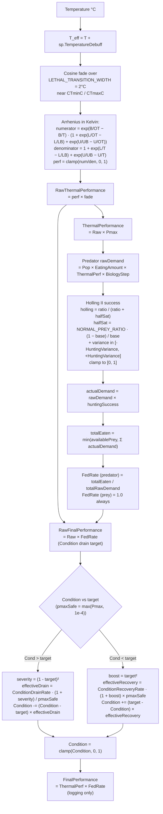

# Biology performance phase (Steps 1–5)

Source: `SimSpecies.CalculatePerformance`, `EcosystemSimulator.ProcessFeeding`, `EcosystemSimulator.UpdateCondition` (v9 Pmax rate scaling).

## Key invariants

- `Pmax` does **not** enter `target`. Target stays at `Raw × FedRate`, so Condition ceiling is 1.0 for every species regardless of Pmax.
- Drain is **asymmetric**: base drain `0.15` > base recovery `0.10` (per-day rates from `SimulationConfig`).
- Quadratic acceleration:
  - Drain multiplier = `1 + (1 − target)²` → reaches 2× at `target = 0`.
  - Recovery multiplier = `1 + target²` → reaches 2× at `target = 1`.
- Pmax rate scaling (v9):
  - Specialists (high Pmax, e.g. 0.9) drain `1 / 0.9 ≈ 1.11×` the base rate (slower relative reduction because denominator is closer to 1).
  - Generalists (low Pmax, e.g. 0.72) drain `1 / 0.72 ≈ 1.39×` the base rate (faster decline under stress).
  - Recovery inverts: specialists recover `× 0.9` ≈ 10% slower; generalists `× 0.72` ≈ 28% slower. (Multiplier ≤ 1 means the recovery term is damped when Pmax < 1.)

## Step 2 — feeding details

- Runs only if `Species.Any(Tier == 1)` and `Species.Any(Tier == 2)` with non-zero populations.
- `NORMAL_PREY_RATIO = 20` is the prey:predator ratio where Holling success equals the species' `HuntingEfficiency`.
- Per-predator `FedRate` is the same `fedRate` (totalEaten / totalRawDemand) — not split by predator. Variance is on hunting success, not on feeding satisfaction.
- Prey removals are distributed proportionally across prey variants via `_predationAccumulators[preyVariant.FullName]`.
