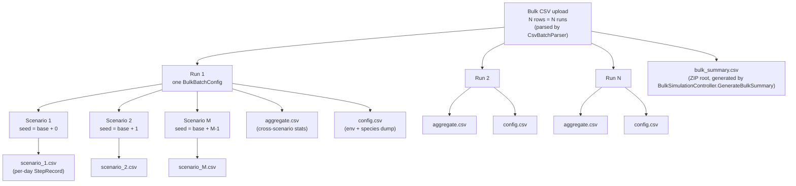

# Bulk → Run → Scenario hierarchy

Source: `BulkSimulationController.cs`, `SimulationController.cs`, `CsvBatchParser.cs`.

## Notes

- **Single-run mode** (`SimulationController`) uses a `SimulationConfig` ScriptableObject instead of a CSV row and skips the outer `Bulk` layer. It emits `scenario_*.csv`, `aggregate.csv`, and `config.csv` at the ZIP root.
- **Number of runs** is `batches.Count` — one per parsed data row in the bulk CSV. `num_scenarios` (CSV column) controls how many scenarios each run produces.
- **Seeds** are derived by the controller per scenario. Reproducibility requires a fixed `BaseSeed`; per-scenario seed is `BaseSeed + s` where `s` is the 0-based scenario position (`BulkSimulationController.cs:208`). `scenarioIndex` in the CSV is 1-based (`s + 1`), so seed for `scenario_1.csv` = `BaseSeed + 0`. If `BaseSeed < 0` the controller passes `-1` and each scenario draws from system time (non-reproducible).
- **Streaming**: in bulk mode the controller streams each scenario's CSV into a progressive ZIP (`WebGLZipDownload.AddFileToProgressiveZip`) or direct upload (`ServerUpload.UploadFile`) as soon as it's ready, then frees the scenario's memory.
- **Output files per run**: `aggregate.csv` always, `config.csv` always; scenario files named `scenario_{ScenarioIndex}.csv` where the index matches the `ScenarioIndex` field on `ScenarioResult`.
