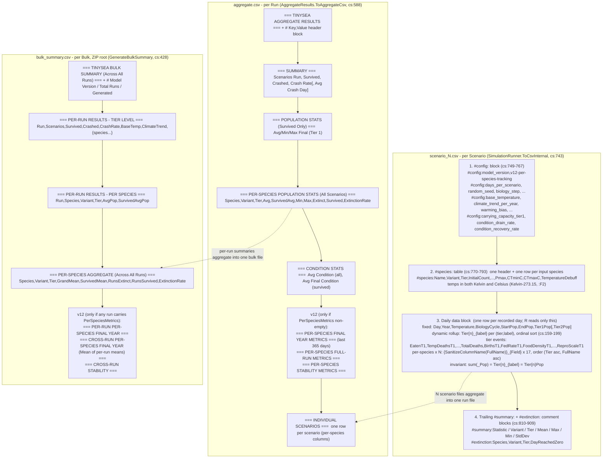

# Diagram: Scenario, Aggregate, and Bulk Summary CSV Layout

This diagram shows the block layout of the three CSV files the simulation writes. `scenario_{N}.csv` is one file per Scenario, built by `SimulationRunner.ToCsvInternal` (`SimulationRunner.cs:743`); it has four parts in fixed order: `#config:` comment lines, a `#species:` input table, the daily data block (the only part R reads, since every `#` line is a comment), and trailing `#summary:`/`#extinction:` comment blocks. `aggregate.csv` is one file per Run, built by `AggregateResults.ToAggregateCsv` (`ScenarioResult.cs:588`); it is a mixed-format file with `=== TITLE ===` section dividers and `# Key,Value` metadata, not one rectangular table. `bulk_summary.csv` is one file at the ZIP root per Bulk upload, built by `BulkSimulationController.GenerateBulkSummary` (`BulkSimulationController.cs:428`). The current shipping mode is Tier 1 only: every Tier 2 column is suppressed when `Tier2Enabled` is `false` (`SimulationRunner.cs:216-232`, `SimulationRunner.cs:270-286`). The daily block appends 17 per-species columns per species, prefixed by `SanitizeColumnName(FullName)` and ordered `(Tier asc, FullName asc)`; the tier-rollup invariant is that per-species `_Pop` columns sum to the dynamic `Tier{n}_{label}` rollup column, which sum to `Tier{n}Pop`. Sections marked v12 appear only when per-species rich metrics exist. For the exact header strings, value formats, and per-column sources see `csv-output-formats.md`.

