# CSV output shape

Source: `SimulationRunner.ToCsvInternal`, `ScenarioResult.ToAggregateCsv`, `ScenarioResult.ToConfigCsv`, `BulkSimulationController.GenerateBulkSummary`, `StepRecord.CsvHeader` / `ToCsvLine`.

```mermaid
flowchart TD
    Run[One run] --> PerScn["Per-scenario CSV<br/>scenario_{N}.csv"]
    Run --> Agg["aggregate.csv<br/>(one per run)"]
    Run --> Cfg["config.csv<br/>(one per run)"]

    PerScn --> PH["#config: header<br/>(20 lines: model_version (v12),<br/>days, scenarios, seed, biology step,<br/>11 temp params, carrying cap, drain/recovery)"]
    PerScn --> PS["#species: table<br/>(1 header row + 1 row per species<br/>with 26 columns inc. both K and C<br/>for temperature fields)"]
    PerScn --> PD["Daily data rows<br/>(StepRecord.CsvHeader/ToCsvLine)<br/>Day..ReproScaleT2 per day +<br/>17 per-species columns × N species (v12)"]
    PerScn --> PSum["#summary: statistics block<br/>Mean/Max/Min/StdDev across days<br/>for each PopColumn"]
    PerScn --> PExt["#extinction: per-variant timing<br/>day reached zero, or -1 if survived"]

    Agg --> AH["=== TINYSEA AGGREGATE RESULTS ===<br/># metadata (generated timestamp, config summary)"]
    Agg --> AS["=== SUMMARY ===<br/>Scenarios Run, Survived, Crashed,<br/>Crash Rate, Avg Crash Day"]
    Agg --> APop["=== POPULATION STATS (Survived Only) ===<br/>Avg/Min/Max Final T1 and T2"]
    Agg --> APer["=== PER-SPECIES POPULATION STATS ===<br/>Avg, SurvivedAvg, Min, Max,<br/>Extinct, Survived, ExtinctionRate"]
    Agg --> ACond["=== CONDITION STATS ===<br/>Avg and Final Condition per tier"]
    Agg --> APerFY["=== PER-SPECIES FINAL YEAR METRICS === (v12)<br/>MeanCondition/BirthRate/PopCv/MeanPop<br/>w/ Mean, StdDev, SurvivedMean per species"]
    Agg --> APerFR["=== PER-SPECIES FULL-RUN METRICS === (v12)<br/>Same metrics over entire scenario"]
    Agg --> APerST["=== PER-SPECIES STABILITY METRICS === (v12)<br/>Min/Max/FinalPop, ExtinctionRate,<br/>MeanExtinctionDay, CrashRate, MeanCrashDay"]
    Agg --> AInd["=== INDIVIDUAL SCENARIOS ===<br/>one row per scenario"]
    Agg --> AGrand["=== SUMMARY STATISTICS<br/>(Grand Mean Across All Runs) ===<br/>GrandMean of Mean/Max/Min/StdDev"]
    Agg --> AExt["=== EXTINCTION TIMING ===<br/>Min/Max/Avg days; extinct vs survived counts"]

    Cfg --> CH["=== section headers ===<br/># metadata lines<br/>Parameter,Value rows for environment"]
    Cfg --> CSpc["=== SPECIES ===<br/>(same 26-column table as #species: in scenario CSV)"]

    Bulk[Bulk upload] --> BulkSum["bulk_summary.csv<br/>(ZIP root, one per bulk)"]
    BulkSum --> BS1["=== TINYSEA BULK SUMMARY ===<br/># Model Version (v12), # Total Runs, # Generated"]
    BulkSum --> BS2["=== PER-RUN RESULTS ===<br/>Run, Scenarios, Survived, Crashed,<br/>CrashRate, BaseTemp, ClimateTrend,<br/>per-species average populations"]
    BulkSum --> BS3["=== PER-SPECIES AGGREGATE (Across All Runs) ===<br/>Species, GrandMean, SurvivedMean,<br/>RunsExtinct, RunsSurvived, ExtinctionRate"]
    BulkSum --> BS4["=== PER-RUN PER-SPECIES FINAL YEAR === (v12)<br/>(run × species) detail rows"]
    BulkSum --> BS5["=== CROSS-RUN PER-SPECIES FINAL YEAR === (v12)<br/>GrandMeanCondition/BirthRate/PopCv/MeanPop<br/>across runs (w/ StdDev)"]
    BulkSum --> BS6["=== CROSS-RUN STABILITY === (v12)<br/>Pooled extinction/crash rates and mean days"]
```



## Section conventions

| Token | Meaning |
|-------|---------|
| `#config:key,value` | R-compatible comment (ignored by `read.csv` default). One line per config key. |
| `#species:col,col,...` | R-compatible comment carrying a header + data rows. Columns include both `OptimalTempK` and `OptimalTempC` (and same for LowerBound/UpperBound) for convenience. |
| `#summary:key,…` | Per-scenario summary statistics block. |
| `#extinction:variant,day` | Per-variant extinction day; `-1` means never extinct during the scenario. |
| `=== TITLE ===` | Section delimiter used by aggregate, config, and bulk-summary CSVs. |
| `# Key,Value` | Metadata line inside a `=== section ===` (not the same as `#config:` — no prefix after the `#`). |

## Column lists (exact)

### `StepRecord.CsvHeader(orderedSpecies)` daily columns (41 fixed + 17×N per-species columns, v12):

```
# Tier-level / variant-level (41 columns, unchanged from v10/v11.1):
Day, Year, Temperature, BiologyCycle,
StartPop, EndPop,
Tier1Pop, Tier2Pop,
Tier1Arctic, Tier1Common, Tier1Tropical, Tier1Custom,
Tier2Arctic, Tier2Common, Tier2Tropical, Tier2Custom,
EatenT1, TempDeathsT1, TempDeathsT2,
ConditionDeathsT1, ConditionDeathsT2,
NaturalDeathsT1, NaturalDeathsT2,
TotalDeaths,
BirthsT1, BirthsT2,
FedRateT2, AvgHuntingEff,
FedRateT1, FoodDensityT1,
AvgConditionT1, AvgConditionT2,
BirthAccumT1, BirthAccumT2,
NaturalDeathAccumT1, NaturalDeathAccumT2,
ConditionDeathAccumT1, ConditionDeathAccumT2,
PredationAccumT1,
ReproScaleT1, ReproScaleT2,
# v12 per-species (appended; species ordered by Tier asc, FullName asc):
{S1}_Pop, {S1}_Cond, {S1}_ThermalPerf, {S1}_FinalPerf,
{S1}_FedRate, {S1}_HuntingEff,
{S1}_Births, {S1}_TempDeaths, {S1}_CondDeaths, {S1}_NatDeaths, {S1}_Eaten,
{S1}_BirthRate, {S1}_ReproScale,
{S1}_BirthAccum, {S1}_NatDeathAccum, {S1}_CondDeathAccum, {S1}_PredAccum,
... (same 17-column block for each subsequent species)
```

`{S}` = `SanitizeColumnName(species.FullName)` — ASCII-only, non-`[A-Za-z0-9_]` replaced by `_`, leading digit prefixed with `_`. Duplicates get `_2`, `_3` suffix.

Populations use `long` to prevent overflow on large ecosystems. `FedRateT1` is the population-weighted average across live Tier 1 species; `FoodDensityT1` is the daily `1 − tier1Pop/cap` value.

**Tier-rollup invariant** (v12): per-species `{S}_Pop` values sum to the matching tier-level column (`Tier1Pop`, `Tier2Pop`). Same for births, eaten counts, all death types.

### `#species:` / config-CSV species columns (26 columns):

```
Name, Variant, Tier, InitialCount,
EatingAmount, ReproductionMultiplier,
DeathThreshold, DeathRate, ReproThreshold,
NaturalDeathRate, NaturalDeathVariance,
HuntingEfficiency, HuntingVariance,
OptimalTempK, OptimalTempC,
ArrhenBreadth, ArrhenLower, ArrhenUpper,
LowerBoundK, LowerBoundC, UpperBoundK, UpperBoundC,
Pmax, CTminC, CTmaxC, TemperatureDebuff
```

## ZIP layout

- **Single-run**: `scenario_*.csv` + `aggregate.csv` + `config.csv` at the ZIP root.
- **Bulk**: `bulk_summary.csv` at the root; one subfolder per run (named by `batch_name`) containing `scenario_*.csv` + `aggregate.csv` + `config.csv`.
