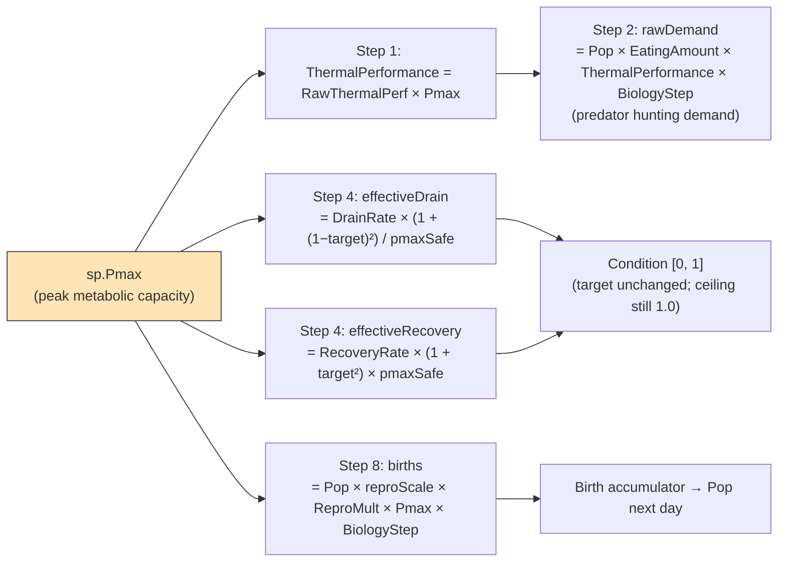

# Where Pmax enters the pipeline (v9; v10/v11/v11.1/v12 don't change Pmax's entry points)

Source: `SimSpecies.Pmax`, `EcosystemSimulator.cs` lines 547 (Step 1), 905 (Step 4 drain), 916 (Step 4 recovery), and 1135 (Step 8 births).

> **Freshness note (verified through v12):** Pmax still enters the pipeline at the same four places as in v9. v10 (food-pool FedRate), v11 (per-predator FedRate), v11.1 (cap always-on), and v12 (per-species event tracking) all leave the four Pmax entry points untouched. What v10 *did* widen is the picture of what drives Condition — Tier 1's Condition target now depends on food density too via FedRate — but Pmax's role is unchanged.

## Where Pmax does NOT enter

- **Step 3** — `RawFinalPerformance = RawThermalPerf × FedRate`. No Pmax. This is the target Condition drifts toward, and the target is deliberately Pmax-free so Condition stays on a species-agnostic 0–1 scale.
- **Step 5** — `FinalPerformance = ThermalPerf × FedRate` includes Pmax via ThermalPerf, but FinalPerformance is **only logged** — it does not feed any biology step.
- **Step 6 — Thermal death**: Triggered by `RawThermalPerf == 0`. No Pmax involvement.
- **Step 7 — Condition death**: `severity = (DeathThreshold − Condition) / DeathThreshold`. `rawDeaths = Pop × severity × DeathRate × BiologyStep`. No Pmax term.
- **Step 8 — No-predator penalty** (`NO_PREDATOR_PENALTY = 0.85`) is Pmax-blind, applied after the `Pmax` multiplication. The soft carrying-cap-on-births modifier was deleted in v10; reproduction is now throttled via the Condition pathway, where Pmax already enters via Step 4 rates and the Step 8 birth multiplier.
- **Step 9 — Natural death**: `rate = NaturalDeathRate ± NaturalDeathVariance`. No Pmax.
- **Newborn Condition (v10)**: newborns inherit the species' current group Condition. Pmax doesn't enter directly here either, but the parent's Condition is itself affected by Pmax (via Step 4 rate scaling), so Pmax shapes newborn starting Condition indirectly through the parent.

## Net effect for a specialist vs generalist

At Topt with Pmax = 0.9 (specialist) vs 0.72 (generalist), both prey, Condition = 1:

| Quantity | Specialist | Generalist | Ratio |
|----------|-----------|-----------|-------|
| ThermalPerformance at Topt | 0.90 | 0.72 | 1.25× |
| Base drain rate multiplier under stress | `/ 0.9 ≈ 1.11×` baseline | `/ 0.72 ≈ 1.39×` baseline | specialist drains 0.80× as fast as generalist |
| Recovery rate multiplier at Topt | `× 0.9` | `× 0.72` | specialist recovers 1.25× as fast as generalist |
| Reproductive output at Condition = 1 | × 0.9 | × 0.72 | specialist produces 1.25× the births |

Pmax therefore acts as a single axis: higher Pmax → better peak output, better stress resistance, better rebound. The design choice of applying Pmax as a rate modifier (rather than folding it into the target) preserves the semantics of `ReproThreshold` and `DeathThreshold` — both thresholds fire at the same Condition value for every species.

## pmaxSafe clamp

`pmaxSafe = Math.Max(sp.Pmax, 1e-4f)` — guards Step 4 against divide-by-zero if `Pmax` is ever set to 0. Not used in Step 8 because division doesn't occur there; Step 8 uses `sp.Pmax` directly.
