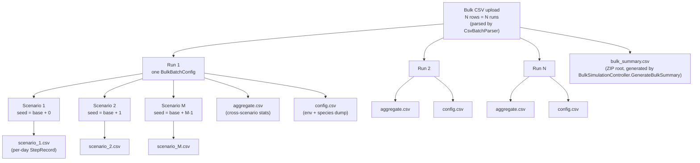
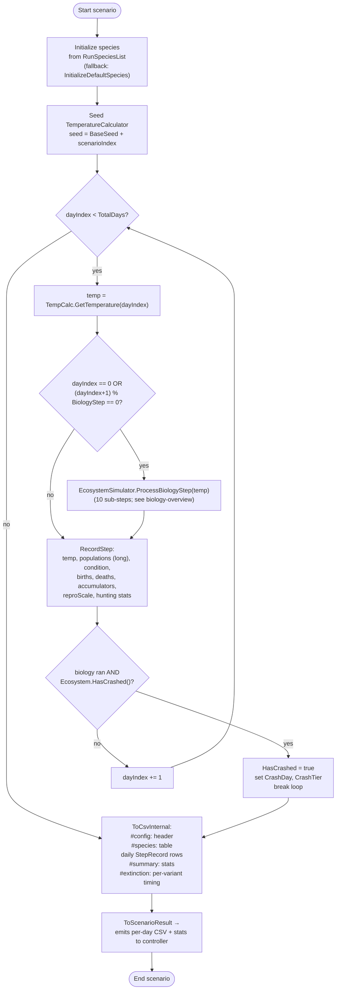
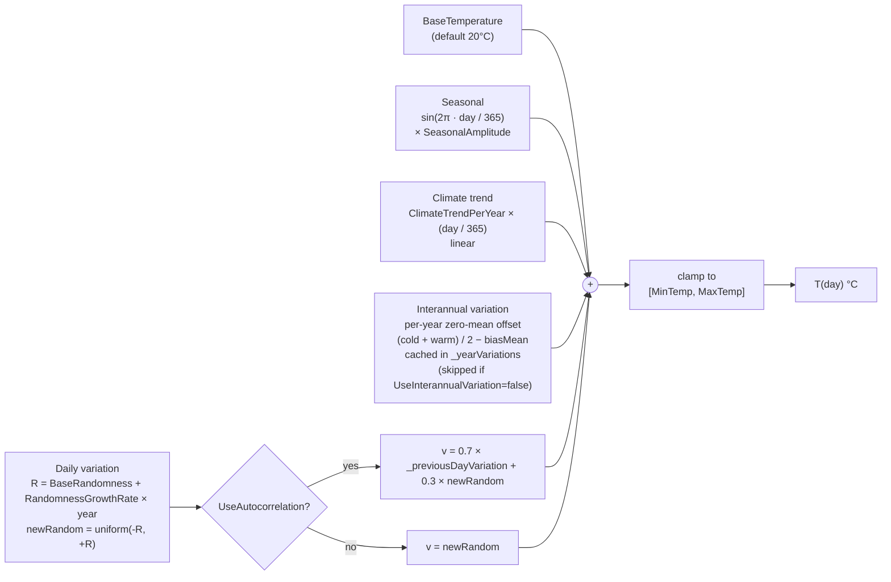
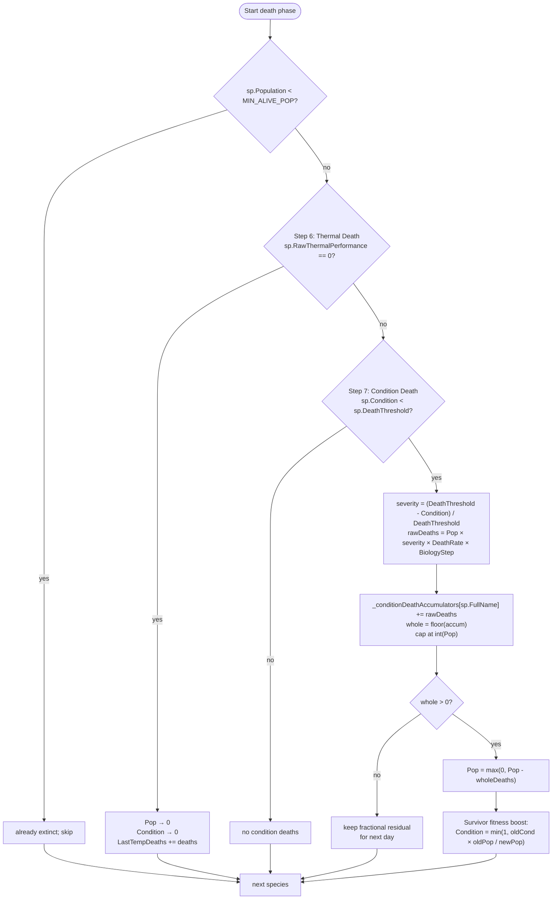
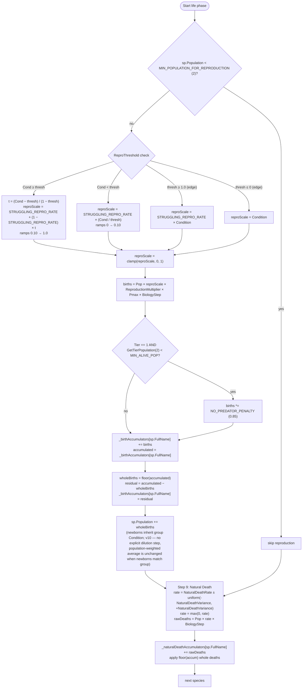
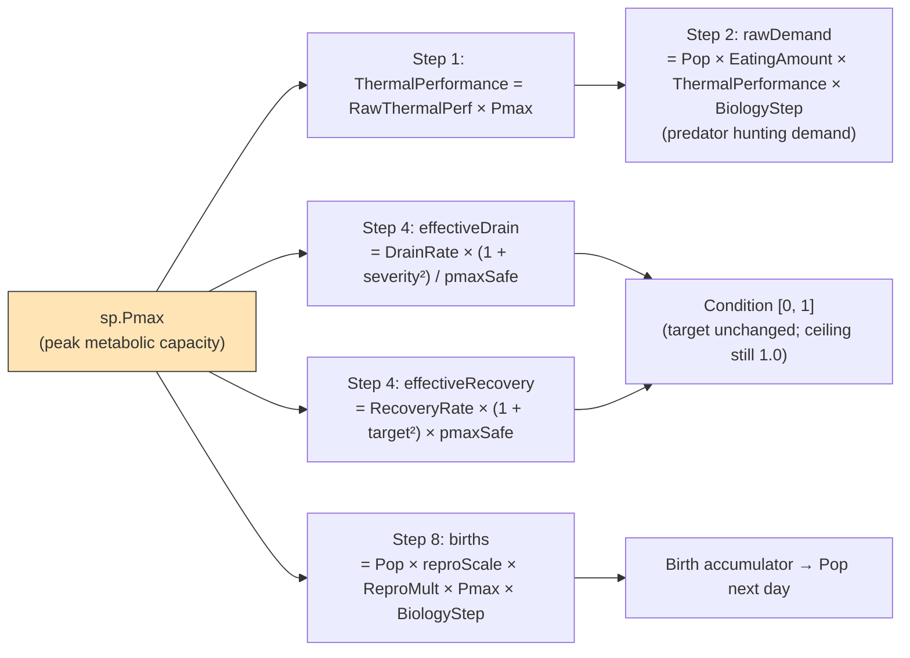
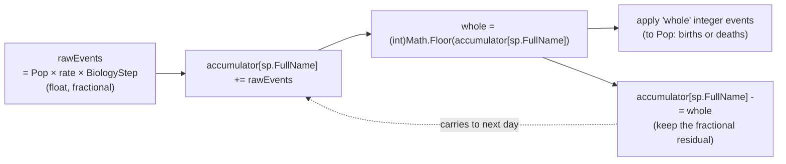

# TinySea Simulation Diagrams

Generated PDF combining all 11 mermaid diagrams from `tinysea/docs/diagrams/`. Sources are derived from C# in `Assets/scripts/Simulation/`.

<div style="page-break-after: always;"></div>

# Simulation Diagrams

One Mermaid diagram per file, each focused on a single flow. Render inline in GitHub, VS Code, Obsidian, or any Mermaid-capable viewer.

All diagrams are derived from the C# source in `Assets/scripts/Simulation/`. If the code changes, update the diagram — do not rely on external references.

## Diagram index

| File | Covers | Primary source |
|------|--------|----------------|
| [bulk-hierarchy.md](./bulk-hierarchy.md) | Bulk CSV → Runs → Scenarios → output files. | `BulkSimulationController.cs` |
| [scenario-flow.md](./scenario-flow.md) | The per-scenario day loop, biology dispatch, crash detection, CSV emission. | `SimulationRunner.cs` |
| [temperature-model.md](./temperature-model.md) | Daily temperature = base + seasonal + trend + interannual + daily noise, clamped. | `TemperatureCalculator.cs` |
| [biology-overview.md](./biology-overview.md) | The 10-step biology sequence invoked each day. | `EcosystemSimulator.ProcessBiologyStep` |
| [biology-performance-phase.md](./biology-performance-phase.md) | Steps 1–5 in detail: Arrhenius, feeding, Condition update. | `EcosystemSimulator.cs`, `SimSpecies.cs` |
| [biology-death-phase.md](./biology-death-phase.md) | Steps 6–7: thermal death (instant) and condition death (graduated + survivor boost). | `EcosystemSimulator.ApplyThermalDeath`, `ApplyConditionDeath` |
| [biology-life-phase.md](./biology-life-phase.md) | Steps 8–9: reproduction (reproScale × Pmax, accumulator, penalties) and natural death. | `EcosystemSimulator.ApplyReproduction`, `ApplyNaturalDeathWithAccumulator` |
| [pmax-flow.md](./pmax-flow.md) | Every place Pmax enters the pipeline, post-v9. | `EcosystemSimulator.cs` |
| [csv-output-shape.md](./csv-output-shape.md) | Per-scenario, aggregate, and bulk-summary CSV section layout. | `SimulationRunner.ToCsv`, `ScenarioResult.ToAggregateCsv`, `BulkSimulationController.GenerateBulkSummary` |
| [accumulator-pattern.md](./accumulator-pattern.md) | Fractional-event accumulator used by births, condition deaths, natural deaths, predation. | `EcosystemSimulator.cs` |

## Conventions

- **Tier 1** = prey; **Tier 2** = predator.
- **Species order** is the order species appear in `RunSpeciesList`. Many biology steps iterate in this order.
- **Pmax** is clamped to `max(Pmax, 1e-4)` before any divisions in the Condition update (`pmaxSafe`) to guard against divide-by-zero.
- **BiologyStep** controls how many simulated days elapse per biology evaluation (default 1). All rate formulas multiply by `BiologyStep`.

<div style="page-break-after: always;"></div>

# Bulk → Run → Scenario hierarchy

Source: `BulkSimulationController.cs`, `SimulationController.cs`, `CsvBatchParser.cs`.



## Notes

- **Single-run mode** (`SimulationController`) uses a `SimulationConfig` ScriptableObject instead of a CSV row and skips the outer `Bulk` layer. It emits `scenario_*.csv`, `aggregate.csv`, and `config.csv` at the ZIP root.
- **Number of runs** is `batches.Count` — one per parsed data row in the bulk CSV. `num_scenarios` (CSV column) controls how many scenarios each run produces.
- **Seeds** are derived by the controller per scenario. Reproducibility requires a fixed `BaseSeed`; per-scenario seed is `BaseSeed + scenarioIndex`.
- **Streaming**: in bulk mode the controller streams each scenario's CSV into a progressive ZIP (`WebGLZipDownload.AddFileToProgressiveZip`) or direct upload (`ServerUpload.UploadFile`) as soon as it's ready, then frees the scenario's memory.
- **Output files per run**: `aggregate.csv` always, `config.csv` always; scenario files named `scenario_{ScenarioIndex}.csv` where the index matches the `ScenarioIndex` field on `ScenarioResult`.

<div style="page-break-after: always;"></div>

# Scenario flow

Source: `SimulationRunner.Run`, `SimulationRunner.RecordStep`, `EcosystemSimulator.HasCrashed`.



## Notes

- **BiologyStep** defaults to 1. Values `2–5` skip biology on non-matching days but still advance temperature and record a row (with death/birth/accumulator fields = 0 on skipped days).
- **Day numbering**: `dayIndex` is 0-based internally; `StepRecord.Day` is 1-based (displayDay). `Year` = `(dayIndex / 365) + 1`.
- **Crash detection**: `Ecosystem.HasCrashed()` returns true when total population is below `MIN_ALIVE_POP` and at least one tier was populated at init (so we don't report a crash for scenarios that intentionally start empty).
- **Early break**: scenarios that crash stop recording further days; subsequent rows of the CSV simply don't exist. Downstream tooling should handle variable-length scenarios.
- **CSV emission** is deferred — records are kept in memory during the run and serialised at the end (via `ToCsvInternal`). Then the result is streamed out (see bulk-hierarchy).

<div style="page-break-after: always;"></div>

# Temperature model

Source: `TemperatureCalculator.cs` — `GetTemperature`, `GetSeasonalComponent`, `GetClimateTrend`, `GetInterannualVariation`, `GetDailyVariation`.



## Component formulas (from source)

| Component | Formula | Behavior |
|-----------|---------|----------|
| Seasonal | `sin(2·π · day / 365) · SeasonalAmplitude` | Coldest at `day = 0`, warmest around `day = 182`. |
| Climate trend | `ClimateTrendPerYear × (day / 365f)` | Linear in simulated years. Cast to float before multiplication. |
| Interannual | `cold = uniform(-VariabilityMagnitude, 0)`; `warm = uniform(0, VariabilityMagnitude × WarmingBias)`; `biasMean = VariabilityMagnitude × (WarmingBias − 1) / 4`; `variation = (cold + warm) / 2 − biasMean`; cached by year in `_yearVariations`. | Same value used for every day in a given year. **Zero-mean by construction**: `WarmingBias` controls only the *shape* of the distribution (warm tail wider than cold tail when `bias > 1`); long-term trend is owned solely by `ClimateTrendPerYear`. |
| Daily raw | `newRandom = uniform(-1, +1) × currentRandomness` where `currentRandomness = BaseRandomness + RandomnessGrowthRate × year`. | Growing noise over time. |
| Daily smoothed | `variation = 0.7 × _previousDayVariation + 0.3 × newRandom` | Red-noise autocorrelation if enabled. `_previousDayVariation` is updated after each call. |
| Final | `clamp(sum_of_components, MinTemp, MaxTemp)` | Hard floor/ceiling. |

## Notes

- `DAYS_PER_YEAR` is a compile-time constant = 365. Leap years are not modelled.
- `GetYear(day)` returns `(day / 365) + 1` — year 1 = days 0–364.
- The RNG is seeded by the constructor (`TemperatureCalculator(seed)`). Passing `-1` uses system time (non-reproducible). `Reset(seed)` can re-seed between runs, clearing `_yearVariations` and `_previousDayVariation`.
- The calculator holds its own RNG independent of `EcosystemSimulator._rng` — temperature draws do not consume the biology RNG stream.

<div style="page-break-after: always;"></div>

# Biology step — 10-step overview

Source: `EcosystemSimulator.ProcessBiologyStep(float temperature)`.

```mermaid
flowchart TD
    Start([ProcessBiologyStep temp]) --> S1["1. Thermal Performance<br/>SimSpecies.CalculatePerformance<br/>Arrhenius + CTmin/CTmax cosine fade<br/>RawThermalPerf; ThermalPerf = Raw × Pmax"]
    S1 --> S2["2. Feeding / Predation<br/>Tier 1: FedRate = min(1, HE × food_density), linear (v10)<br/>Tier 2: Holling II + per-predator FedRate (v11)<br/>fedRate_i = min(1, huntingSuccess_i × scarcityFactor)<br/>_predationAccumulators on prey"]
    S2 --> S3["3. Raw Final Performance<br/>RawFinalPerf = Raw × FedRate<br/>(Condition drain target — varies with food density for Tier 1 in v10)"]
    S3 --> S4["4. Update Condition<br/>asymmetric drift toward target<br/>rates scaled by Pmax (pmaxSafe)"]
    S4 --> S5["5. Final Performance<br/>FinalPerf = ThermalPerf × FedRate<br/>(computed for logging; not read downstream)"]
    S5 --> S6["6. Thermal Death<br/>instant wipeout when RawThermalPerf == 0"]
    S6 --> S7["7. Condition Death<br/>graduated severity below DeathThreshold<br/>survivor fitness boost<br/>_conditionDeathAccumulators"]
    S7 --> S8["8. Reproduction (v10: no soft cap on births)<br/>reproScale(Condition) × Pmax<br/>Tier 1 NO_PREDATOR_PENALTY only<br/>_birthAccumulators<br/>newborns inherit parent group Condition"]
    S8 --> S9["9. Natural Death<br/>flat NaturalDeathRate ± variance<br/>_naturalDeathAccumulators"]
    S9 --> S10["10. Population Rounding<br/>round away-from-zero"]
    S10 --> End([End step])
```



## Ordering and iteration

Every step iterates `Species` in the order they were added to `RunSpeciesList`. In v10, the only previously order-dependent step (Step 8 carrying-cap-on-births) was deleted, so Step 8 is now order-independent. The remaining steps were always order-independent — they don't read state that previous species in the same step have written.

## What each step writes back

| Step | Writes | Notes |
|------|--------|-------|
| 1 | `RawThermalPerformance`, `ThermalPerformance` | Per species. |
| 2 | `FedRate` (Tier 1 AND Tier 2), `CurrentHuntingSuccess`, `LastFedRateT1`, `LastFedRateT2`, `LastFoodDensityT1`, `LastAvgHuntingEfficiency`, `LastEatenT1`, accumulator updates on prey | v10: Tier 1 FedRate = min(1, HE × food_density), no longer hardcoded to 1.0. |
| 3 | `RawFinalPerformance` | Per species. |
| 4 | `Condition` (clamped 0–1), `AvgConditionT1`/`AvgConditionT2` later | `oldCondition` logged. |
| 5 | `FinalPerformance` | Never read again in this pipeline. |
| 6 | `Population → 0`, `Condition → 0` when lethal | Also increments `LastTempDeathsT1`/`T2`. |
| 7 | `Population -= wholeDeaths`, `Condition` boosted, `LastConditionDeathsT1`/`T2`, `_conditionDeathAccumulators` | Survivor boost caps Condition at 1.0. |
| 8 | `Population += wholeBirths`, `LastBirthsT1`/`T2`, `_birthAccumulators`, `LastReproScaleT1`/`T2` | v10: only Tier 1 modifier left is `NO_PREDATOR_PENALTY` (carrying-cap-on-births deleted). Newborns inherit group Condition (no explicit dilution step). |
| 9 | `Population -= wholeNaturalDeaths`, `LastNaturalDeathsT1`/`T2`, `_naturalDeathAccumulators` | No Condition effect. |
| 10 | `Population = Math.Round(Population, AwayFromZero)` | All populations integer-valued between days. |

After Step 10, `ComputeAverageCondition()` + `UpdateAccumulatorTotals()` + `EndPopT1/T2` are updated for the CSV record.

<div style="page-break-after: always;"></div>

# Biology performance phase (Steps 1–5)

Source: `SimSpecies.CalculatePerformance`, `EcosystemSimulator.ProcessFeedingWithAccumulator`, `EcosystemSimulator.UpdateCondition` (v9 Pmax rate scaling, v10 Tier 1 food-pool FedRate).

```mermaid
flowchart TD
    Temp["Temperature °C"] --> Offset["T_eff = T + sp.TemperatureDebuff"]
    Offset --> Fade["Cosine fade over<br/>LETHAL_TRANSITION_WIDTH = 2°C<br/>near CTminC / CTmaxC"]
    Fade --> Arr["Arrhenius in Kelvin:<br/>numerator = exp(B/OT − B/T) · (1 + exp(L/OT − L/LB) + exp(U/UB − U/OT))<br/>denominator = 1 + exp(L/T − L/LB) + exp(U/UB − U/T)<br/>perf = clamp(num/den, 0, 1)"]
    Arr --> Raw["RawThermalPerformance<br/>= perf × fade"]
    Raw --> TP["ThermalPerformance<br/>= Raw × Pmax"]

    Pop1["tier1Pop = sum of Tier 1 populations"] --> FoodDensity["food_density = max(0, 1 − tier1Pop / cap)<br/>cap always on (v11.1); cap floored at 1"]
    FoodDensity --> FedRateT1["FedRate (Tier 1, v10) = min(1, HE × food_density)<br/>linear extraction (NOT Holling II)"]

    TP --> PredDemand["Predator rawDemand<br/>= Pop × EatingAmount × ThermalPerf × BiologyStep"]
    PredDemand --> Holling["Holling II success<br/>holling = ratio / (ratio + halfSat)<br/>halfSat = NORMAL_PREY_RATIO · (1 − base) / base<br/>+ variance in [-HuntingVariance, +HuntingVariance]<br/>clamp to [0, 1]"]
    Holling --> Actual["actualDemand = rawDemand × huntingSuccess"]
    Actual --> Eaten["totalEaten = min(availablePrey, Σ actualDemand)"]
    Eaten --> ScarcityT2["scarcityFactor (v11)<br/>= totalEaten / totalActualDemand<br/>(1.0 when prey abundant)"]
    ScarcityT2 --> FedRateT2["FedRate_i (Tier 2, v11)<br/>= min(1, huntingSuccess_i × scarcityFactor)<br/>(per-predator; LastFedRateT2 = pop-weighted avg)"]

    Raw --> RFP["RawFinalPerformance<br/>= Raw × FedRate<br/>(Condition drain target)"]
    FedRateT1 --> RFP
    FedRateT2 --> RFP

    RFP --> CondStep{"Condition vs target<br/>(pmaxSafe = max(Pmax, 1e-4))"}
    CondStep -- "Cond > target" --> Drain["severity = (1 - target)²<br/>effectiveDrain = ConditionDrainRate · (1 + severity) / pmaxSafe<br/>Condition -= (Condition - target) × effectiveDrain"]
    CondStep -- "Cond < target" --> Recov["boost = target²<br/>effectiveRecovery = ConditionRecoveryRate · (1 + boost) × pmaxSafe<br/>Condition += (target - Condition) × effectiveRecovery"]
    Drain --> Clamp["Condition = clamp(Condition, 0, 1)"]
    Recov --> Clamp
    Clamp --> FP["FinalPerformance<br/>= ThermalPerf × FedRate<br/>(logging only)"]
```



## Key invariants

- `Pmax` does **not** enter `target`. Target stays at `Raw × FedRate`, so Condition ceiling is 1.0 for every species regardless of Pmax.
- Drain is **asymmetric**: base drain `0.15` > base recovery `0.10` (per-day rates from `SimulationConfig`).
- Quadratic acceleration:
  - Drain multiplier = `1 + (1 − target)²` → reaches 2× at `target = 0`.
  - Recovery multiplier = `1 + target²` → reaches 2× at `target = 1`.
- Pmax rate scaling (v9):
  - Specialists (high Pmax, e.g. 0.9) drain `1 / 0.9 ≈ 1.11×` the base rate (slower relative reduction because denominator is closer to 1).
  - Generalists (low Pmax, e.g. 0.72) drain `1 / 0.72 ≈ 1.39×` the base rate (faster decline under stress).
  - Recovery inverts: specialists recover `× 0.9` ≈ 10% slower; generalists `× 0.72` ≈ 28% slower. (Multiplier ≤ 1 means the recovery term is damped when Pmax < 1.)

## Step 2 — feeding details

### 2a. Tier 1 (food-pool, linear, v10)

- Runs unconditionally — does not require predators to be present.
- `food_density = max(0, 1 − tier1Pop / max(CarryingCapacityPerTier, 1))`. Carrying capacity is always on (v11.1); the previous toggle was removed because Tier 1 species without a resource ceiling grow without bound.
- `FedRate = min(1, HuntingEfficiency × food_density)`. Default HE=1 gives `FedRate = food_density`.
- **Linear, not Holling II.** Tier 1 represents passive extractors (plankton, filter feeders). No search/handling phases. Holling II would also collapse to 1 at HE=1, defeating the food-pool effect.
- For Tier 1, `HuntingEfficiency` is semantically "resource extraction efficiency" — same field, dual meaning by tier.

### 2b. Tier 2 (Holling II + per-predator FedRate, v11)

- Runs only if `Species.Any(Tier == 1)` and `Species.Any(Tier == 2)` with non-zero populations.
- `NORMAL_PREY_RATIO = 20` is the prey:predator ratio where Holling success equals the species' `HuntingEfficiency`.
- **Per-predator FedRate (v11)**: `scarcityFactor = totalEaten / totalActualDemand` (1.0 when prey abundant); `fedRate_i = min(1, huntingSuccess_i × scarcityFactor)`. Each predator's feeding satisfaction reflects its own hunting effort. `LastFedRateT2` (CSV column) is now a population-weighted average across predator species. Reduces to v10 pooled formula in single-predator-species runs.
- Prey removals are distributed proportionally across prey variants via `_predationAccumulators[preyVariant.FullName]`. (No predator-side preference for prey variants — separate concern, B7 in pending list.)

<div style="page-break-after: always;"></div>

# Biology death phase (Steps 6–7)

Source: `EcosystemSimulator.ApplyThermalDeath`, `EcosystemSimulator.ApplyConditionDeath`.



## Design rationale (from source comments)

- **Thermal death is terminal**. Performance reaching zero means the organism is past its lethal limit (`CTmin` or `CTmax` after the 2°C cosine fade). No Condition buffer can save it; population and condition both go to zero.
- **Suboptimal-but-survivable** temperatures do **not** trigger Step 6 — they drive Condition down in Step 4, and Step 7 converts chronic low Condition into graduated mortality.
- **Condition death is graduated** (not a cliff). Severity ranges from `0` at `Condition = DeathThreshold` to `1` at `Condition = 0`. Source citations: Casini et al. (2016), Dutil & Lambert (2000), Booth & Hixon (1999) — mortality proportional to condition severity, not binary.
- **Survivor fitness boost** prevents death spirals. After deaths, `Condition = oldCond × oldPop / newPop` (capped at 1.0). This assumes the dead were the weakest (condition ≈ 0) and redistributes the survivor pool's health. Without this, a hit below `DeathThreshold` would compound as the group's average Condition stays low and more deaths keep firing.

## Accumulator detail

`_conditionDeathAccumulators[sp.FullName]` is a float that carries fractional deaths across days. If `rawDeaths = 0.3/day`, after four days the accumulator has 1.2 → one whole death fires, 0.2 residual carries forward. Scaling by `BiologyStep` means multi-day biology cycles multiply `rawDeaths` accordingly.

## Pmax does NOT appear here

Both Step 6 and Step 7 are Pmax-blind. Specialist resilience comes indirectly — in Step 4 their Condition drains slower (v9 Pmax rate scaling), so they cross `DeathThreshold` less often.

<div style="page-break-after: always;"></div>

# Biology life phase (Steps 8–9)

Source: `EcosystemSimulator.ApplyReproduction` (v9: Pmax multiplier; v10: soft-cap-on-births deleted, newborns inherit parent Condition), `EcosystemSimulator.ApplyNaturalDeathWithAccumulator`.



## Reproduction key invariants

- **Two-region piecewise formula** for `reproScale`, continuous at `ReproThreshold` (both halves meet at `STRUGGLING_REPRO_RATE = 0.10`).
- **Pmax multiplier (v9)**: `births *= sp.Pmax`. A specialist (Pmax = 0.9) produces 25% more births at the same Condition as a generalist (Pmax = 0.72).
- **No-predator penalty** is 0.85 — Tier 1 gets 15% fewer births when no predators exist, modelling ecosystem imbalance.
- **(v10) Soft cap on births DELETED.** Tier 1 is now throttled indirectly via the Condition pathway: high pop → low food density (Step 2a) → low FedRate → low RawFinalPerformance target → Condition drains → reproScale shrinks AND condition deaths fire. The processing-order bug from the live `tierPop` read is gone with this code path.
- **Birth accumulator** carries fractional births. Matters at low `reproScale` or low population, where daily births < 1.
- **(v10) Newborn Condition = parent group Condition.** No fixed `NEWBORN_CONDITION = 0.5` constant. Parent's Condition already encodes recent food / hunting history via lagged drain dynamics, so multiplying again by today's FedRate would double-count. Mathematically: the population-weighted average is unchanged when newborns match the group, so no explicit Condition update step is needed. Newborn vulnerability emerges from same-drain-no-head-start dynamics in subsequent days.

## Natural death key invariants

- Independent of temperature, Condition, feeding, and predation.
- Rate is re-rolled per species per step from `[NaturalDeathRate − NaturalDeathVariance, NaturalDeathRate + NaturalDeathVariance]`.
- Uses its own accumulator; fractional deaths carry to the next day.
- Natural death does **not** give a survivor fitness boost (unlike condition death). It models stochastic mortality rather than health-driven.

## Step order within a single species

Species loops are nested: each step iterates all species before moving on. So reproduction (8) and natural death (9) for a given species are not adjacent in wall time — Step 8 completes for **every** species before Step 9 begins.

<div style="page-break-after: always;"></div>

# Where Pmax enters the pipeline (v9; v10 doesn't change Pmax's entry points)

Source: `SimSpecies.Pmax`, `EcosystemSimulator.ProcessBiologyStep` lines covering Steps 1, 2, 4, 8.

> **v10 note:** Pmax still enters the pipeline at the same four places as in v9. What v10 changes is the broader picture of what *drives Condition*: in addition to thermal performance and feeding, Tier 1's Condition target now also depends on **food density** (via the FedRate computed from the shared resource pool). So the full "what determines Condition" picture is wider than just temperature, but Pmax's role is unchanged.



## Where Pmax does NOT enter

- **Step 3** — `RawFinalPerformance = RawThermalPerf × FedRate`. No Pmax. This is the target Condition drifts toward, and the target is deliberately Pmax-free so Condition stays on a species-agnostic 0–1 scale.
- **Step 5** — `FinalPerformance = ThermalPerf × FedRate` includes Pmax via ThermalPerf, but FinalPerformance is **only logged** — it does not feed any biology step.
- **Step 6 — Thermal death**: Triggered by `RawThermalPerf == 0`. No Pmax involvement.
- **Step 7 — Condition death**: `severity = (DeathThreshold − Condition) / DeathThreshold`. `rawDeaths = Pop × severity × DeathRate × BiologyStep`. No Pmax term.
- **Step 8 — No-predator penalty** (`NO_PREDATOR_PENALTY = 0.85`) is Pmax-blind, applied after the `Pmax` multiplication. The soft carrying-cap-on-births modifier was deleted in v10; reproduction is now throttled via the Condition pathway, where Pmax already enters via Step 4 rates and the Step 8 birth multiplier.
- **Step 9 — Natural death**: `rate = NaturalDeathRate ± NaturalDeathVariance`. No Pmax.
- **Newborn Condition (v10)**: newborns inherit the species' current group Condition. Pmax doesn't enter directly here either, but the parent's Condition is itself affected by Pmax (via Step 4 rate scaling), so Pmax shapes newborn starting Condition indirectly through the parent.

## Net effect for a specialist vs generalist

At Topt with Pmax = 0.9 (specialist) vs 0.72 (generalist), both prey, Condition = 1:

| Quantity | Specialist | Generalist | Ratio |
|----------|-----------|-----------|-------|
| ThermalPerformance at Topt | 0.90 | 0.72 | 1.25× |
| Base drain rate multiplier under stress | `/ 0.9 ≈ 1.11×` baseline | `/ 0.72 ≈ 1.39×` baseline | specialist drains 0.80× as fast as generalist |
| Recovery rate multiplier at Topt | `× 0.9` | `× 0.72` | specialist recovers 1.25× as fast as generalist |
| Reproductive output at Condition = 1 | × 0.9 | × 0.72 | specialist produces 1.25× the births |

Pmax therefore acts as a single axis: higher Pmax → better peak output, better stress resistance, better rebound. The design choice of applying Pmax as a rate modifier (rather than folding it into the target) preserves the semantics of `ReproThreshold` and `DeathThreshold` — both thresholds fire at the same Condition value for every species.

## pmaxSafe clamp

`pmaxSafe = Math.Max(sp.Pmax, 1e-4f)` — guards Step 4 against divide-by-zero if `Pmax` is ever set to 0. Not used in Step 8 because division doesn't occur there; Step 8 uses `sp.Pmax` directly.

<div style="page-break-after: always;"></div>

# CSV output shape

Source: `SimulationRunner.ToCsvInternal`, `ScenarioResult.ToAggregateCsv`, `ScenarioResult.ToConfigCsv`, `BulkSimulationController.GenerateBulkSummary`, `StepRecord.CsvHeader` / `ToCsvLine`.

```mermaid
flowchart TD
    Run[One run] --> PerScn["Per-scenario CSV<br/>scenario_{N}.csv"]
    Run --> Agg["aggregate.csv<br/>(one per run)"]
    Run --> Cfg["config.csv<br/>(one per run)"]

    PerScn --> PH["#config: header<br/>(20 lines: model_version (v12),<br/>days, scenarios, seed, biology step,<br/>11 temp params, carrying cap, drain/recovery)"]
    PerScn --> PS["#species: table<br/>(1 header row + 1 row per species<br/>with 26 columns inc. both K and C<br/>for temperature fields)"]
    PerScn --> PD["Daily data rows<br/>(StepRecord.CsvHeader/ToCsvLine)<br/>Day..ReproScaleT2 per day +<br/>17 per-species columns × N species (v12)"]
    PerScn --> PSum["#summary: statistics block<br/>Mean/Max/Min/StdDev across days<br/>for each PopColumn"]
    PerScn --> PExt["#extinction: per-variant timing<br/>day reached zero, or -1 if survived"]

    Agg --> AH["=== TINYSEA AGGREGATE RESULTS ===<br/># metadata (generated timestamp, config summary)"]
    Agg --> AS["=== SUMMARY ===<br/>Scenarios Run, Survived, Crashed,<br/>Crash Rate, Avg Crash Day"]
    Agg --> APop["=== POPULATION STATS (Survived Only) ===<br/>Avg/Min/Max Final T1 and T2"]
    Agg --> APer["=== PER-SPECIES POPULATION STATS ===<br/>Avg, SurvivedAvg, Min, Max,<br/>Extinct, Survived, ExtinctionRate"]
    Agg --> ACond["=== CONDITION STATS ===<br/>Avg and Final Condition per tier"]
    Agg --> APerFY["=== PER-SPECIES FINAL YEAR METRICS === (v12)<br/>MeanCondition/BirthRate/PopCv/MeanPop<br/>w/ Mean, StdDev, SurvivedMean per species"]
    Agg --> APerFR["=== PER-SPECIES FULL-RUN METRICS === (v12)<br/>Same metrics over entire scenario"]
    Agg --> APerST["=== PER-SPECIES STABILITY METRICS === (v12)<br/>Min/Max/FinalPop, ExtinctionRate,<br/>MeanExtinctionDay, CrashRate, MeanCrashDay"]
    Agg --> AInd["=== INDIVIDUAL SCENARIOS ===<br/>one row per scenario"]
    Agg --> AGrand["=== SUMMARY STATISTICS<br/>(Grand Mean Across All Runs) ===<br/>GrandMean of Mean/Max/Min/StdDev"]
    Agg --> AExt["=== EXTINCTION TIMING ===<br/>Min/Max/Avg days; extinct vs survived counts"]

    Cfg --> CH["=== section headers ===<br/># metadata lines<br/>Parameter,Value rows for environment"]
    Cfg --> CSpc["=== SPECIES ===<br/>(same 26-column table as #species: in scenario CSV)"]

    Bulk[Bulk upload] --> BulkSum["bulk_summary.csv<br/>(ZIP root, one per bulk)"]
    BulkSum --> BS1["=== TINYSEA BULK SUMMARY ===<br/># Model Version (v12), # Total Runs, # Generated"]
    BulkSum --> BS2["=== PER-RUN RESULTS ===<br/>Run, Scenarios, Survived, Crashed,<br/>CrashRate, BaseTemp, ClimateTrend,<br/>per-species average populations"]
    BulkSum --> BS3["=== PER-SPECIES AGGREGATE (Across All Runs) ===<br/>Species, GrandMean, SurvivedMean,<br/>RunsExtinct, RunsSurvived, ExtinctionRate"]
    BulkSum --> BS4["=== PER-RUN PER-SPECIES FINAL YEAR === (v12)<br/>(run × species) detail rows"]
    BulkSum --> BS5["=== CROSS-RUN PER-SPECIES FINAL YEAR === (v12)<br/>GrandMeanCondition/BirthRate/PopCv/MeanPop<br/>across runs (w/ StdDev)"]
    BulkSum --> BS6["=== CROSS-RUN STABILITY === (v12)<br/>Pooled extinction/crash rates and mean days"]
```



## Section conventions

| Token | Meaning |
|-------|---------|
| `#config:key,value` | R-compatible comment (ignored by `read.csv` default). One line per config key. |
| `#species:col,col,...` | R-compatible comment carrying a header + data rows. Columns include both `OptimalTempK` and `OptimalTempC` (and same for LowerBound/UpperBound) for convenience. |
| `#summary:key,…` | Per-scenario summary statistics block. |
| `#extinction:variant,day` | Per-variant extinction day; `-1` means never extinct during the scenario. |
| `=== TITLE ===` | Section delimiter used by aggregate, config, and bulk-summary CSVs. |
| `# Key,Value` | Metadata line inside a `=== section ===` (not the same as `#config:` — no prefix after the `#`). |

## Column lists (exact)

### `StepRecord.CsvHeader(orderedSpecies)` daily columns (41 fixed + 17×N per-species columns, v12):

```
# Tier-level / variant-level (41 columns, unchanged from v10/v11.1):
Day, Year, Temperature, BiologyCycle,
StartPop, EndPop,
Tier1Pop, Tier2Pop,
Tier1Arctic, Tier1Common, Tier1Tropical, Tier1Custom,
Tier2Arctic, Tier2Common, Tier2Tropical, Tier2Custom,
EatenT1, TempDeathsT1, TempDeathsT2,
ConditionDeathsT1, ConditionDeathsT2,
NaturalDeathsT1, NaturalDeathsT2,
TotalDeaths,
BirthsT1, BirthsT2,
FedRateT2, AvgHuntingEff,
FedRateT1, FoodDensityT1,
AvgConditionT1, AvgConditionT2,
BirthAccumT1, BirthAccumT2,
NaturalDeathAccumT1, NaturalDeathAccumT2,
ConditionDeathAccumT1, ConditionDeathAccumT2,
PredationAccumT1,
ReproScaleT1, ReproScaleT2,
# v12 per-species (appended; species ordered by Tier asc, FullName asc):
{S1}_Pop, {S1}_Cond, {S1}_ThermalPerf, {S1}_FinalPerf,
{S1}_FedRate, {S1}_HuntingEff,
{S1}_Births, {S1}_TempDeaths, {S1}_CondDeaths, {S1}_NatDeaths, {S1}_Eaten,
{S1}_BirthRate, {S1}_ReproScale,
{S1}_BirthAccum, {S1}_NatDeathAccum, {S1}_CondDeathAccum, {S1}_PredAccum,
... (same 17-column block for each subsequent species)
```

`{S}` = `SanitizeColumnName(species.FullName)` — ASCII-only, non-`[A-Za-z0-9_]` replaced by `_`, leading digit prefixed with `_`. Duplicates get `_2`, `_3` suffix.

Populations use `long` to prevent overflow on large ecosystems. `FedRateT1` is the population-weighted average across live Tier 1 species; `FoodDensityT1` is the daily `1 − tier1Pop/cap` value.

**Tier-rollup invariant** (v12): per-species `{S}_Pop` values sum to the matching tier-level column (`Tier1Pop`, `Tier2Pop`). Same for births, eaten counts, all death types.

### `#species:` / config-CSV species columns (26 columns):

```
Name, Variant, Tier, InitialCount,
EatingAmount, ReproductionMultiplier,
DeathThreshold, DeathRate, ReproThreshold,
NaturalDeathRate, NaturalDeathVariance,
HuntingEfficiency, HuntingVariance,
OptimalTempK, OptimalTempC,
ArrhenBreadth, ArrhenLower, ArrhenUpper,
LowerBoundK, LowerBoundC, UpperBoundK, UpperBoundC,
Pmax, CTminC, CTmaxC, TemperatureDebuff
```

## ZIP layout

- **Single-run**: `scenario_*.csv` + `aggregate.csv` + `config.csv` at the ZIP root.
- **Bulk**: `bulk_summary.csv` at the root; one subfolder per run (named by `batch_name`) containing `scenario_*.csv` + `aggregate.csv` + `config.csv`.

<div style="page-break-after: always;"></div>

# Accumulator pattern

Source: `_birthAccumulators`, `_predationAccumulators`, `_naturalDeathAccumulators`, `_conditionDeathAccumulators`, `_thermalDeathAccumulators` (declared in `EcosystemSimulator.cs`).



## Why

The simulator operates on daily timesteps, but biological events are rarely integer-sized. A species with 100 individuals and a 0.003/day natural death rate expects 0.3 deaths per day — rounding each day to 0 would lose all mortality; rounding to 1 would overcount 3×.

Accumulators let fractional events build up across days. Death or birth only manifests as an integer delta to `Population` once enough fractional events have accumulated.

## Users of this pattern

| Accumulator | Step | Event type | Key |
|-------------|------|-----------|-----|
| `_birthAccumulators` | 8 | Births (adds to `Population`) | `sp.FullName` |
| `_predationAccumulators` | 2 | Prey removals (distributed across prey variants) | `sp.FullName` |
| `_naturalDeathAccumulators` | 9 | Natural deaths | `sp.FullName` |
| `_conditionDeathAccumulators` | 7 | Condition-driven deaths | `sp.FullName` |
| `_thermalDeathAccumulators` | declared, unused | — | thermal death is binary/instant (Step 6), so fractional accumulation is unnecessary |

## Accumulator lifecycle

- **Initialization**: `InitializeAccumulators(fullName)` is called per species in `InitializeFromRunSpeciesList`, zeroing the entry in each dictionary.
- **Reset**: `ClearAccumulators()` zeroes all five dictionaries. Invoked at scenario start and whenever species are re-seeded.
- **Snapshot**: `UpdateAccumulatorTotals()` copies current accumulator values to public properties (`BirthAccumT1`, `NaturalDeathAccumT1`, etc.) so each day's `StepRecord` can capture them.

## CSV visibility

Accumulator values are written to every daily row in the scenario CSV:

**Tier-level (legacy, sums across the tier):**

```
BirthAccumT1, BirthAccumT2,
NaturalDeathAccumT1, NaturalDeathAccumT2,
ConditionDeathAccumT1, ConditionDeathAccumT2,
PredationAccumT1
```

**Per-species (v12, residuals exposed via accessors):**

```
{S}_BirthAccum, {S}_NatDeathAccum, {S}_CondDeathAccum, {S}_PredAccum
```

The per-species accumulator residuals are read at CSV-write time via the public accessors `EcosystemSimulator.GetBirthAccum(fullName)`, `GetNaturalDeathAccum(fullName)`, `GetConditionDeathAccum(fullName)`, `GetPredationAccum(fullName)` (added in v12). For Tier 2 species, `{S}_PredAccum` is always 0 (predation accumulator is Tier 1 only).

They can be non-zero even on days where `LastBirthsT1 == 0` — meaning the simulator has accumulated partial births but hasn't crossed the whole-integer threshold yet.

## Per-variant predation note

`_predationAccumulators` is special: prey deaths are computed at the tier level (how many prey were eaten total) and then distributed across prey variants proportional to their populations. Each variant's key in the dictionary is that variant's `FullName` (e.g. `"Hexapod_Arctic"`).
