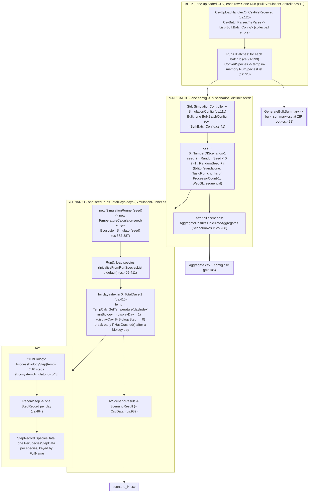

# Diagram: Bulk to Run to Scenario to Day Hierarchy

This diagram shows the four nested execution levels of the headless simulation and the artifact each level emits. A Bulk is one uploaded CSV where each data row is one Run; a Run is one configuration that spawns N Scenarios with distinct seeds; a Scenario is one seeded execution of `SimulationRunner.Run()` that advances a day loop for `TotalDays` days; each biology day runs the ten-step `ProcessBiologyStep`, and each recorded day produces one `StepRecord` carrying a `PerSpeciesStepData` sub-row per species keyed by `FullName`. The per-scenario seed is `RandomSeed < 0 ? -1 : RandomSeed + i` where `i` is the zero-based scenario index (`SimulationController.cs:209`, `BulkSimulationController.cs:259`); a non-negative base seed makes the run reproducible, while `-1` selects clock-seeded non-reproducible mode. Standard runs come from a `SimulationConfig` ScriptableObject driven by `SimulationController`; bulk runs come from `BulkBatchConfig` rows driven by `BulkSimulationController`, which builds a throwaway in-memory `RunSpeciesList` per batch and never mutates the project asset. The current simulator is Tier 1 only; the bulk parser hard-rejects any Tier 2 row (`CsvBatchParser.cs:318-319`). The right column lists the output artifact at each level. For field-by-field parameter copies, threading, and CSV column layouts see `run-scenario-batch.md`, `bulk-system.md`, and `csv-output-formats.md`.

