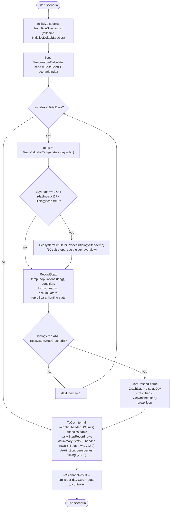

# Scenario flow

Source: `SimulationRunner.Run`, `SimulationRunner.RecordStep`, `EcosystemSimulator.HasCrashed`.

## Notes

- **BiologyStep** defaults to 1. Values `2–5` skip biology on non-matching days but still advance temperature and record a row (with death/birth/accumulator fields = 0 on skipped days).
- **Day numbering**: `dayIndex` is 0-based internally; `StepRecord.Day` is 1-based (displayDay). `Year` = `(dayIndex / 365) + 1`.
- **Crash detection** (`EcosystemSimulator.cs:1319-1323`): `Ecosystem.HasCrashed()` is exact-equality `totalPop == 0` (sum of Tier 1 + Tier 2). No `MIN_ALIVE_POP` floor, no init-state guard. Tier attribution lives separately in `GetCrashedTier()` (`EcosystemSimulator.cs:1325-1331`), which uses `_tier1WasPopulated` / `_tier2WasPopulated` to decide whether to return tier 0 (all-dead), 1, 2, or `-1` (no relevant collapse). This matches simulation-spec §5.
- **Early break**: scenarios that crash stop recording further days; subsequent rows of the CSV simply don't exist. Downstream tooling should handle variable-length scenarios.
- **CSV emission** is deferred — records are kept in memory during the run and serialised at the end (via `ToCsvInternal`). Then the result is streamed out (see bulk-hierarchy).
