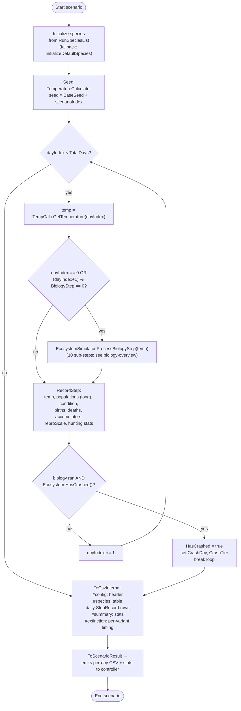

# Scenario flow

Source: `SimulationRunner.Run`, `SimulationRunner.RecordStep`, `EcosystemSimulator.HasCrashed`.

## Notes

- **BiologyStep** defaults to 1. Values `2–5` skip biology on non-matching days but still advance temperature and record a row (with death/birth/accumulator fields = 0 on skipped days).
- **Day numbering**: `dayIndex` is 0-based internally; `StepRecord.Day` is 1-based (displayDay). `Year` = `(dayIndex / 365) + 1`.
- **Crash detection**: `Ecosystem.HasCrashed()` returns true when total population is below `MIN_ALIVE_POP` and at least one tier was populated at init (so we don't report a crash for scenarios that intentionally start empty).
- **Early break**: scenarios that crash stop recording further days; subsequent rows of the CSV simply don't exist. Downstream tooling should handle variable-length scenarios.
- **CSV emission** is deferred — records are kept in memory during the run and serialised at the end (via `ToCsvInternal`). Then the result is streamed out (see bulk-hierarchy).
