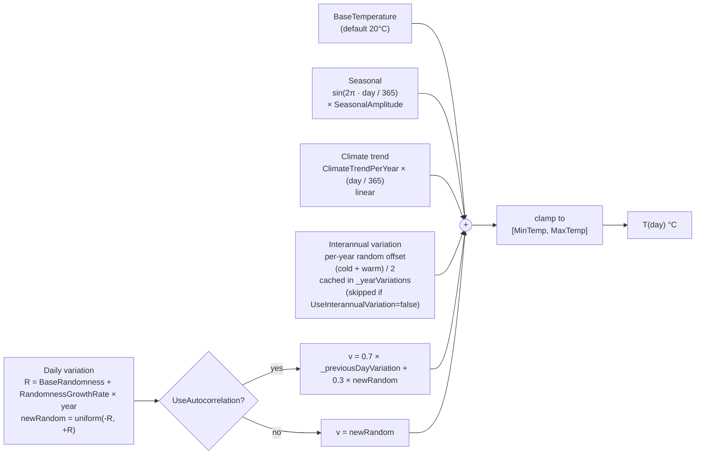

# Temperature model

Source: `TemperatureCalculator.cs` — `GetTemperature`, `GetSeasonalComponent`, `GetClimateTrend`, `GetInterannualVariation`, `GetDailyVariation`.

## Component formulas (from source)

| Component | Formula | Behavior |
|-----------|---------|----------|
| Seasonal | `sin(2·π · day / 365) · SeasonalAmplitude` | Coldest at `day = 0`, warmest around `day = 182`. |
| Climate trend | `ClimateTrendPerYear × (day / 365f)` | Linear in simulated years. Cast to float before multiplication. |
| Interannual | `cold = uniform(-VariabilityMagnitude, 0)`; `warm = uniform(0, VariabilityMagnitude × WarmingBias)`; `variation = (cold + warm) / 2`; cached by year in `_yearVariations`. | Same value used for every day in a given year. |
| Daily raw | `newRandom = uniform(-1, +1) × currentRandomness` where `currentRandomness = BaseRandomness + RandomnessGrowthRate × year`. | Growing noise over time. |
| Daily smoothed | `variation = 0.7 × _previousDayVariation + 0.3 × newRandom` | Red-noise autocorrelation if enabled. `_previousDayVariation` is updated after each call. |
| Final | `clamp(sum_of_components, MinTemp, MaxTemp)` | Hard floor/ceiling. |

## Notes

- `DAYS_PER_YEAR` is a compile-time constant = 365. Leap years are not modelled.
- `GetYear(day)` returns `(day / 365) + 1` — year 1 = days 0–364.
- The RNG is seeded by the constructor (`TemperatureCalculator(seed)`). Passing `-1` uses system time (non-reproducible). `Reset(seed)` can re-seed between runs, clearing `_yearVariations` and `_previousDayVariation`.
- The calculator holds its own RNG independent of `EcosystemSimulator._rng` — temperature draws do not consume the biology RNG stream.
