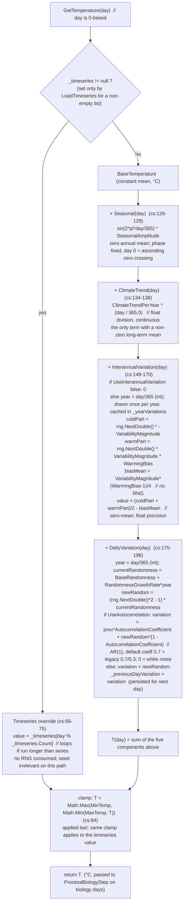

# Diagram: Daily Temperature Assembly

This flowchart shows how `TemperatureCalculator.GetTemperature(int day)` produces the single ambient temperature in degrees Celsius for one day (`TemperatureCalculator.cs:61-85`). The argument `day` is a zero-based index; day 0 is the first simulated day. There are two paths. If a non-empty daily series was loaded with `LoadTimeseries`, the method returns the series value indexed by `day % Count` (looping when the run is longer than the series) and clamps it, consuming no RNG (`TemperatureCalculator.cs:66-75`). Otherwise the parametric model sums five components and clamps the result to `[MinTemp, MaxTemp]` (`TemperatureCalculator.cs:77-84`). Of the five components, only the climate trend carries a non-zero long-term mean; the seasonal sine averages to zero over a year, and the interannual and daily terms are zero-mean by construction. The model is tier-independent: it produces one ambient temperature for the whole ecosystem. Per-species `TemperatureDebuff` is applied later, inside the thermal curve, and is not part of this diagram; see `temperature-model.md` and `biology-and-formulas.md` for variables, defaults, and the RNG-consumption order (one daily draw per day, plus two interannual draws on the first day of each new year).

